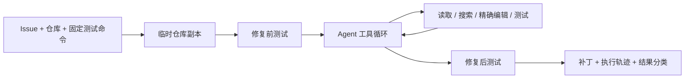

# 项目设计与推进状态

## 目标

给定一个小型代码仓库和可验证的 Issue，让 Agent 在仓库副本中定位问题、修改代码并运行测试。所有模型决策、工具调用和结果都可追溯，便于评测失败原因。

## 五部分进度

| 部分 | 已有内容 | 后续验收 |
|---|---|---|
| 1. 任务与基线 | 10 个合成任务、17 个来自四个上游项目的真实历史缺陷任务；均验证修复前失败和参考修复后通过 | 继续扩充其他项目的真实任务，并记录筛选与排除情况 |
| 2. Agent 主流程 | 文件检索、读取、精确编辑、测试、运行轨迹 | 在真实仓库上完成在线端到端运行 |
| 3. 可靠性 | 仓库副本、路径限制、测试超时、按行读取大文件、最多 5 个改动文件与 20 次编辑 | 分析真实失败轨迹，再优化工具和提示词 |
| 4. 评测 | 批量任务格式、结果分类、通过率、token 和耗时汇总；`analyze` 可离线重算已有报告 | 固定模型与配置后跑完整任务集，形成优化前后对比 |
| 5. 作品集 | README、架构说明、可复现的离线演示 | 补真实数据、演示视频、简历描述 |

## 费用边界

`demo`、`check` 和 `analyze` 不加载密钥、不访问模型服务。`run` 和 `eval` 需要显式传入 `--live` 才会加载密钥并发起 API 请求。当前阶段只运行离线命令。离线演示使用预设的工具调用，**不代表模型实际能力**；分析命令默认排除演示报告。

## 正式任务集的要求

1. 选择有固定版本、可在本机运行测试的仓库，并记录 commit SHA。
2. 每条 Issue 描述一个明确行为变更，包含复现方式和验收条件。
3. 每个任务使用独立仓库副本，修复前测试必须失败。
4. 公开测试文件在 Agent 运行期间不可编辑；独立验收位于 Agent 临时仓库之外，两组测试都通过才算成功。
5. 记录失败类别、执行轨迹、token 用量和耗时。示例任务不计入简历效果数据。

## 当前边界

这是本地可信仓库的实验实现。`run_tests` 会执行仓库代码；对陌生仓库运行前应加入操作系统或容器级隔离。工具不允许模型直接运行任意命令，仓库副本会排除 `.env` 等文件，但不能保证识别所有自定义秘密文件。挑选公开仓库时仍需审查内容。
